# 🏥 Hospital Service

A Django web application for managing a clinic: patients search for doctors and book appointments, while doctors manage their schedule and fill in medical records.

## Table of Contents

- [Features](#features)
- [Live Demo](#live-demo)
- [Tech Stack](#tech-stack)
- [Project Structure](#project-structure)
- [Database Schema](#database-schema)
- [Screenshots](#screenshots)
- [Installation](#installation)
- [Seeding Demo Data](#seeding-demo-data)
- [Usage](#usage)
- [Testing](#testing)

## Features

**For patients**
- Registration and authentication
- Search doctors by specialization
- Book an appointment with a chosen doctor
- View and cancel own appointments (with search by doctor)
- View medical record history (with search by diagnosis)

**For doctors**
- View personal appointment schedule (with search by patient)
- Confirm scheduled appointments
- Fill in a medical record after an appointment — the appointment is automatically marked as "completed"

**General**
- Role separation (`patient` / `doctor`) built into a custom user model
- Home page with clinic stats (number of doctors, departments, patients)
- UI built with Bootstrap 5 via `django-crispy-forms`

## Live Demo

**Application:** https://hospital-service-u3m3.onrender.com

### Demo Account

| Username | Password |
|---|---|
| `user` | `user12345` |

Use this account to explore the application without creating a new user.

## Tech Stack

- **Python 3 / Django 6**
- **SQLite** — default database
- **django-crispy-forms + crispy-bootstrap5** — form rendering
- **Bootstrap 5** — frontend

## Project Structure

```
hospital_service/
├── hospital/                  # main app
│   ├── models.py              # CustomUser, DoctorProfile, PatientProfile,
│   │                          # Department, Specialization, Symptom,
│   │                          # Appointment, MedicalRecord
│   ├── views.py                # class-based views
│   ├── forms.py
│   ├── mixins.py               # PatientRequiredMixin, DoctorRequiredMixin
│   ├── urls.py
│   ├── templatetags/
│   └── tests/
├── hospital_service/          # project settings
│   ├── settings.py
│   ├── urls.py
│   └── wsgi.py / asgi.py
├── templates/
├── static/
├── requirements.txt
└── manage.py
```

## Database Schema

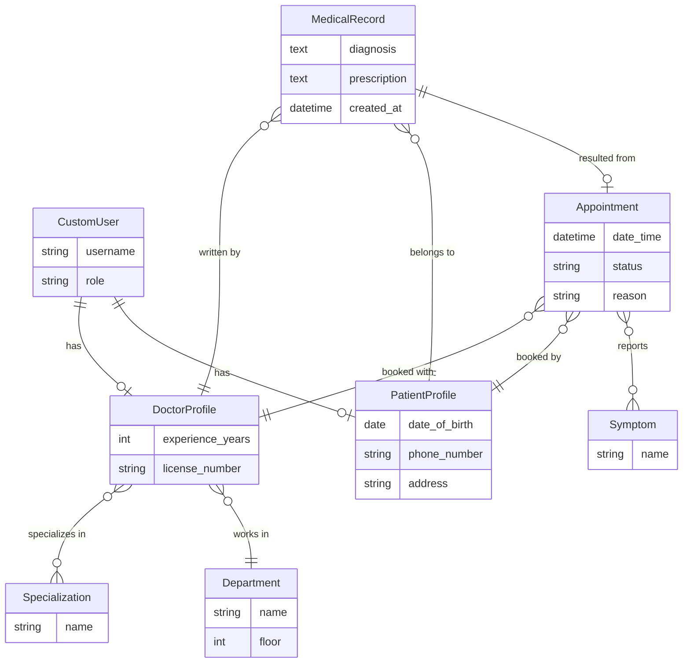

**Complexity overview:**

| Relation | Type | Notes |
|---|---|---|
| CustomUser → DoctorProfile | 1:1 | one profile per doctor account |
| CustomUser → PatientProfile | 1:1 | one profile per patient account |
| DoctorProfile → Department | N:1 | each doctor belongs to one department |
| DoctorProfile ↔ Specialization | M:N | a doctor can have several specializations |
| Appointment → DoctorProfile | N:1 | each appointment is with one doctor |
| Appointment → PatientProfile | N:1 | each appointment is booked by one patient |
| Appointment ↔ Symptom | M:N | an appointment can list several symptoms |
| MedicalRecord → Appointment | 1:1 (optional) | a record can be linked to the appointment it came from |
| MedicalRecord → DoctorProfile / PatientProfile | N:1 each | who wrote it and who it belongs to |

`Appointment` and `MedicalRecord` are the most connected tables (3–4 foreign keys each), making them the core of the data model; the rest (`Department`, `Specialization`, `Symptom`) are simple lookup tables with no dependencies of their own.

## Screenshots

### Guest

| Home | Login | Register |
|---|---|---|
| 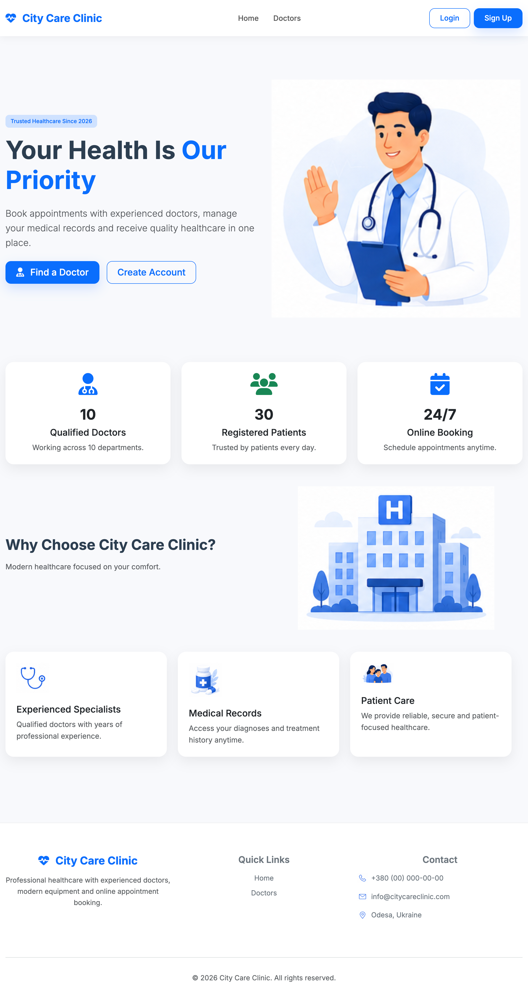 | 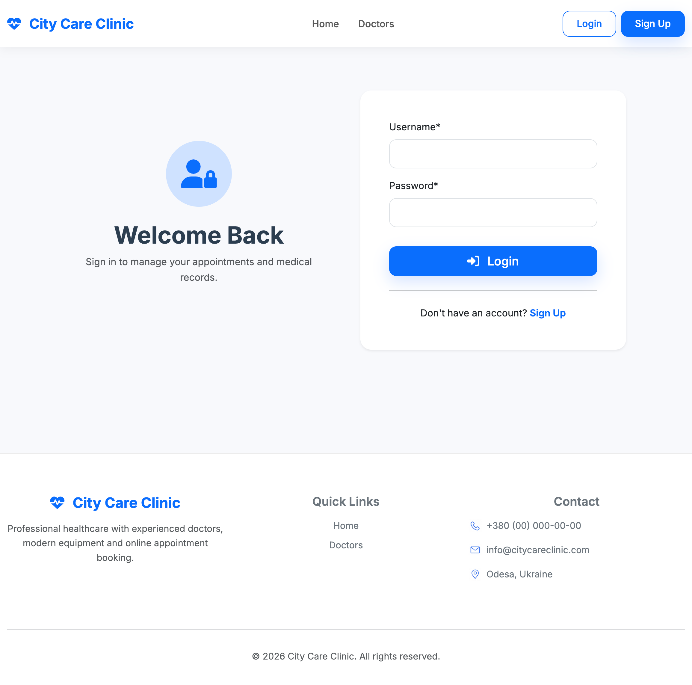 | 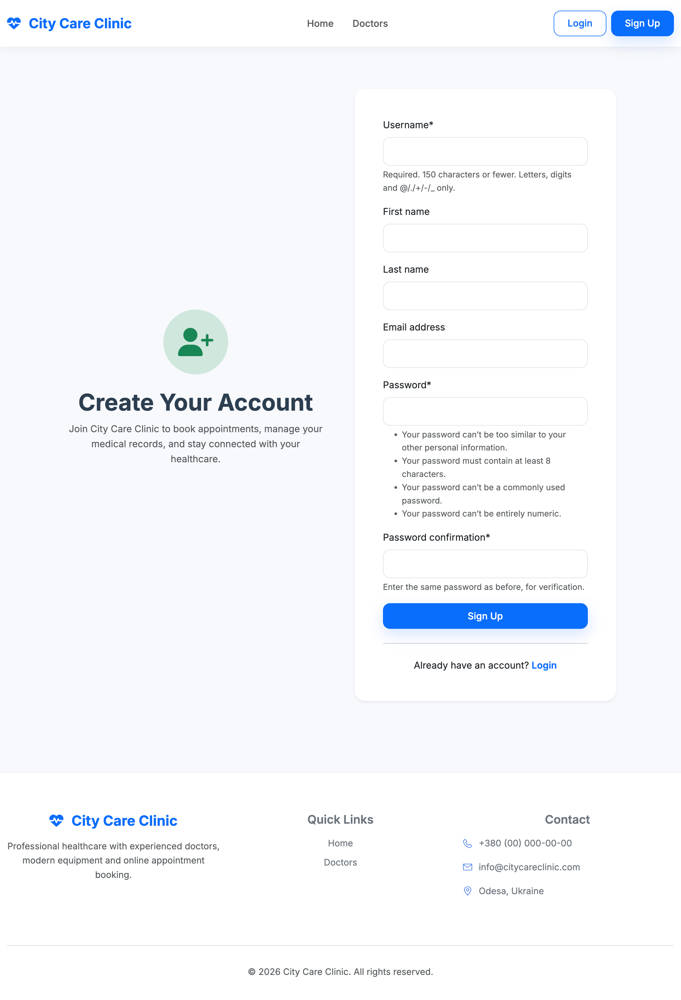 |

| Doctor list | Doctor detail |
|---|---|
| 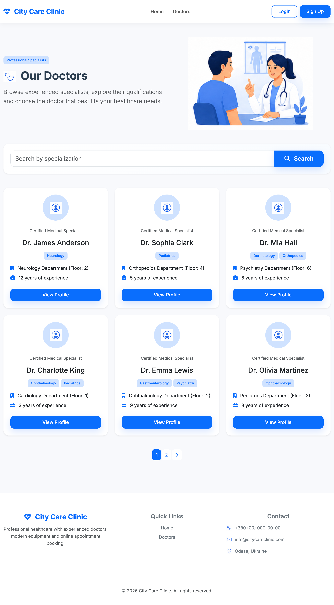 | 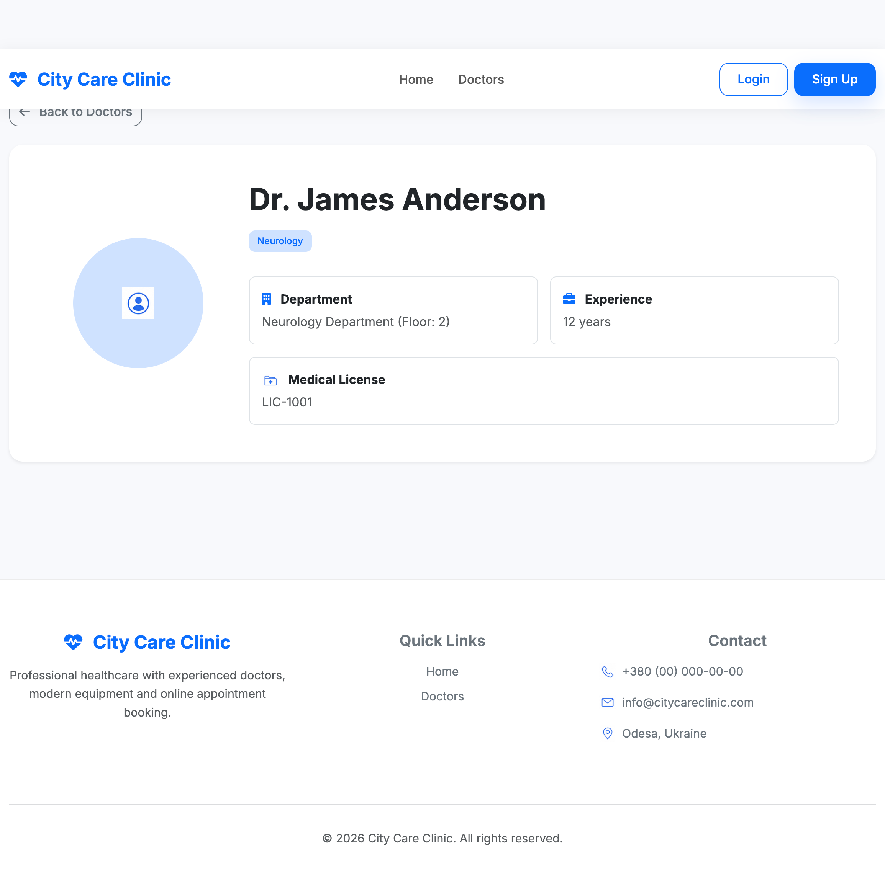 |

### Patient

| Book an appointment | My appointments |
|---|---|
| 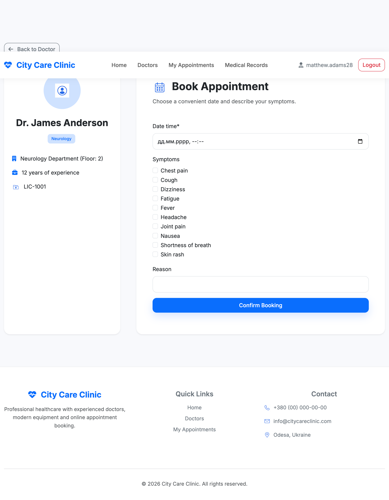 | 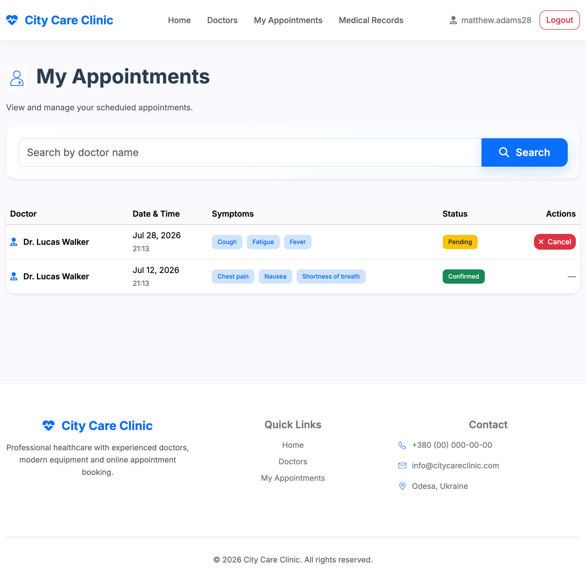 |

| My appointments (search) | My medical records |
|---|---|
| 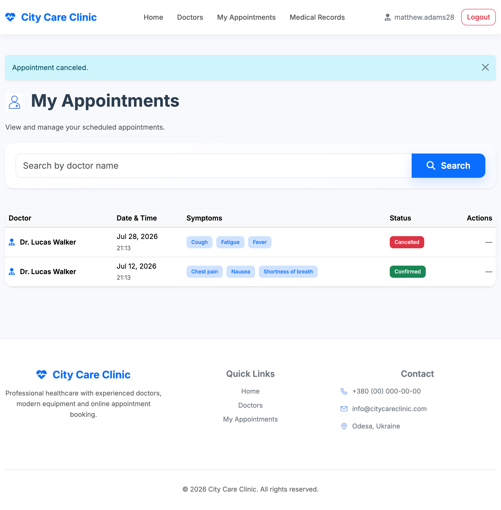 | 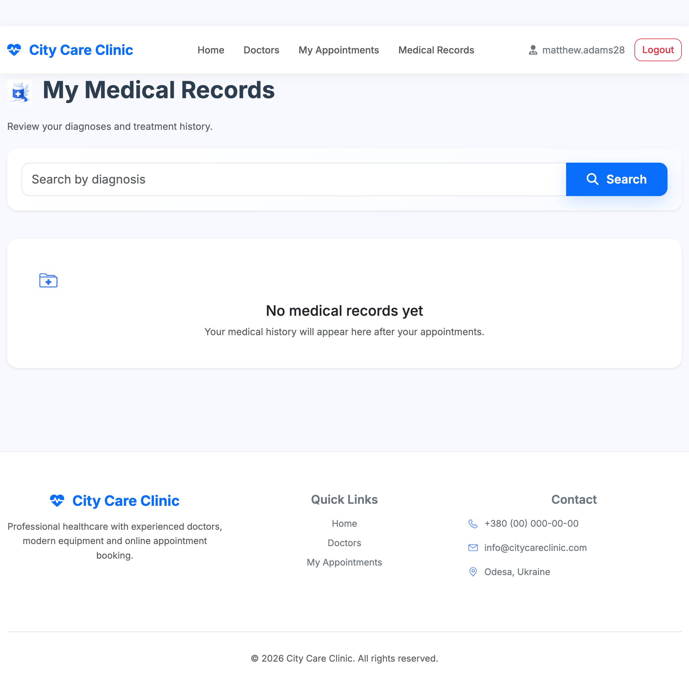 |

### Doctor

| Doctor schedule | Create medical record |
|---|---|
| 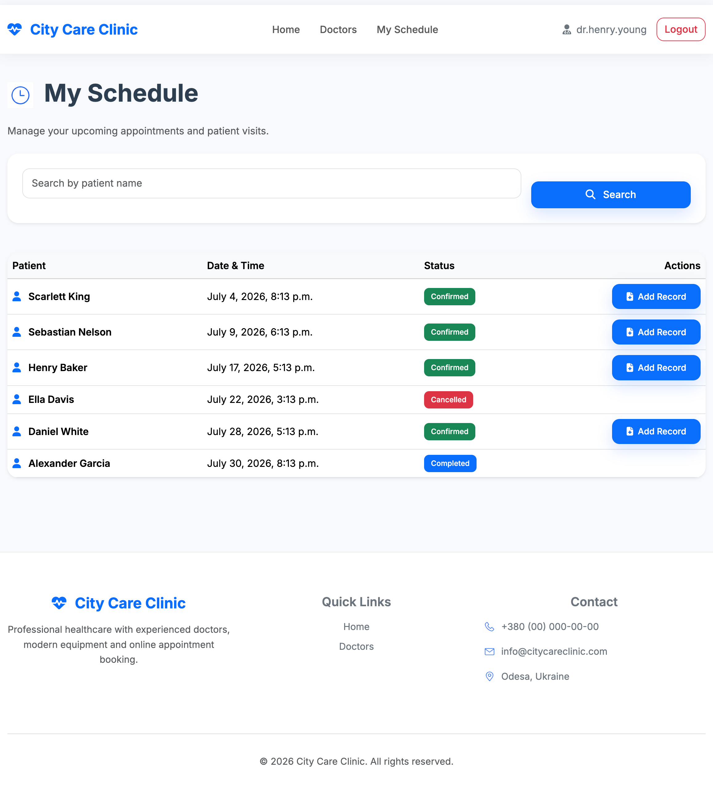 | 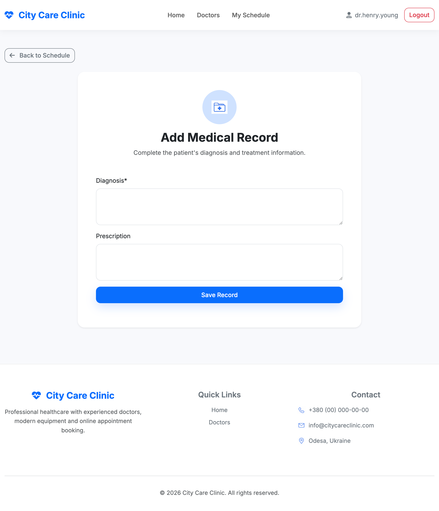 |

## Installation

1. Clone the repository:

   ```bash
   git clone https://github.com/Sardor-Tozhiyev/hospital_service.git
   cd hospital_service
   ```

2. Create and activate a virtual environment:

   ```bash
   python -m venv venv
   source venv/bin/activate      # Linux / macOS
   venv\Scripts\activate         # Windows
   ```

3. Install dependencies:

   ```bash
   pip install -r requirements.txt
   ```

4. Apply migrations:

   ```bash
   python manage.py migrate
   ```

5. Create a superuser (for admin panel access):

   ```bash
   python manage.py createsuperuser
   ```

6. Run the development server:

   ```bash
   python manage.py runserver
   ```

7. Open [http://127.0.0.1:8000](http://127.0.0.1:8000) in your browser.

### Environment Variables (optional)

For production, you can set:

| Variable | Description | Default |
|---|---|---|
| `DJANGO_SECRET_KEY` | Django secret key | insecure key in code |
| `DJANGO_DEBUG` | Debug mode | `True` |
| `DJANGO_ALLOWED_HOSTS` | Allowed hosts (comma-separated) | `127.0.0.1,localhost` |

## Seeding Demo Data

A management command is included to fill the database with realistic demo data — useful for screenshots and manual testing.

It creates:

| Model | Count |
|---|---|
| Specialization | 10 |
| Department | 10 |
| Symptom | 10 |
| Doctor (user + profile) | 10 |
| Patient (user + profile) | 30 |
| Appointment | 40 (mixed statuses: pending / confirmed / completed / cancelled) |
| MedicalRecord | one for every completed appointment |

Run it after migrations:

```bash
python manage.py seed_data
```

To wipe existing non-superuser accounts and re-seed from scratch:

```bash
python manage.py seed_data --flush
```

To only delete the demo data (doctors, patients, appointments, medical records, departments, specializations, symptoms) without creating new data — your admin/superuser account is kept:

```bash
python manage.py seed_data --flush-only
```

All generated accounts (doctors and patients) share the same password: **`Test12345!`**
Usernames follow the pattern `dr.firstname.lastname` for doctors and `firstname.lastnameN` for patients — check the terminal output or the Django admin for exact usernames.

## Usage

1. Register as a patient on the sign-up page.
2. Find a doctor by specialization in the doctors list.
3. Book an appointment with the chosen doctor.
4. The doctor (created via the admin panel or a separate account with the `doctor` role) sees the appointment in their schedule, confirms it, and fills in a medical record after the visit.
5. The patient can track the appointment status and view their medical record history in their dashboard.

## Testing

```bash
python manage.py test
```

## License

This project was created for educational purposes as part of a portfolio.